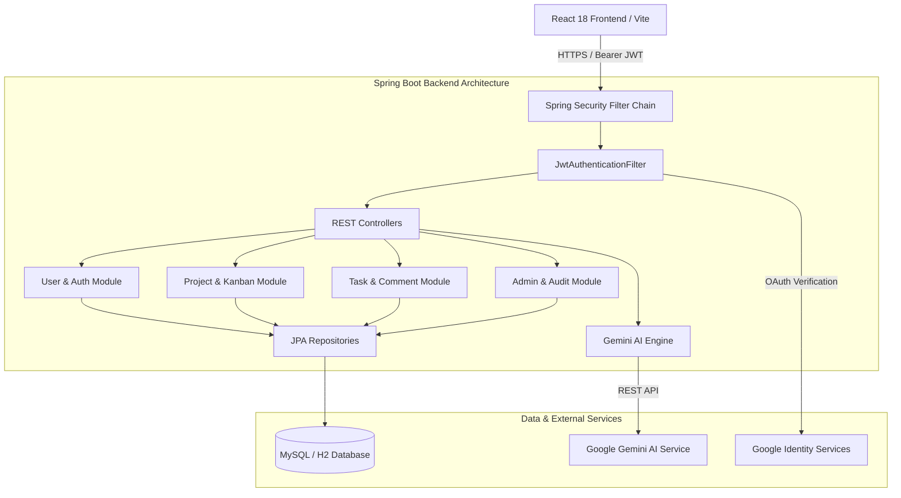
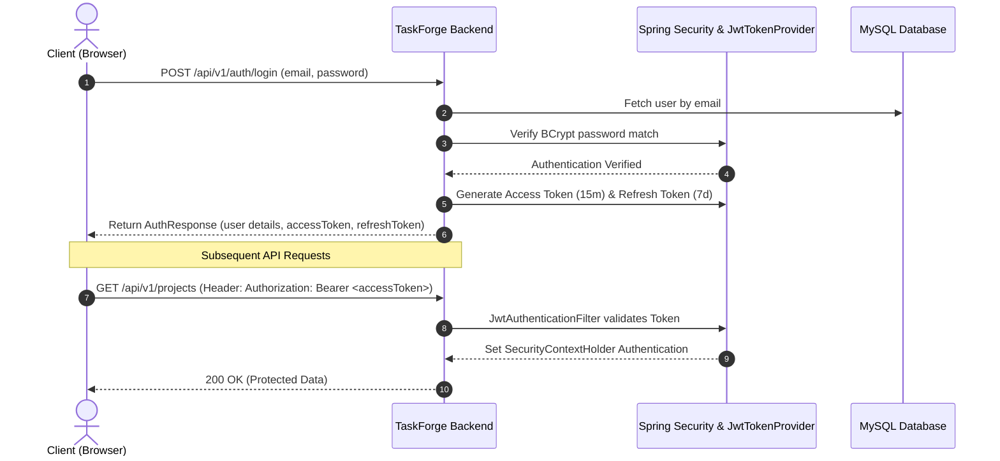

# 🚀 TaskForge AI — Next-Generation AI-Driven Project Management Platform

[](https://spring.io/projects/spring-boot)
[](https://react.dev/)
[](https://www.oracle.com/java/)
[](https://jwt.io/)
[](https://tailwindcss.com/)
[](LICENSE)

**TaskForge AI** is an enterprise-grade, full-stack project management platform that fuses modern engineering workflows with artificial intelligence. Built with **Spring Boot 3.3.4**, **React 18**, **Spring Security JWT**, and **Google OAuth 2.0**, TaskForge AI empowers development teams to automate sprint planning, breakdown tasks, visualize progress on dynamic Kanban boards, and collaborate in real-time.

---

## 📌 Table of Contents
- [Project Overview](#-project-overview)
- [Key Features](#-key-features)
- [System Architecture](#-system-architecture)
- [Tech Stack](#-tech-stack)
- [Authentication & Security](#-authentication--security)
- [Project Structure](#-project-structure)
- [Installation Guide](#-installation-guide)
- [Environment Variables](#-environment-variables)
- [API Documentation Summary](#-api-documentation-summary)
- [Role-Based Access Control](#-role-based-access-control)
- [AI Module Integration](#-ai-module-integration)
- [Screenshots](#-screenshots)
- [Deployment Guide](#-deployment-guide)
- [Contribution & License](#-contribution--license)

---

## 💡 Project Overview

Software engineering teams spend countless hours manually breaking down epics, estimating effort, calculating velocity, and managing access permissions. **TaskForge AI** addresses this challenge by providing an intelligent assistant integrated into an intuitive workspace.

- **AI-Powered Sprint Automation**: Instantly decompose high-level project goals into modules, milestones, and actionable tasks with accurate time estimates using Google Gemini AI.
- **Enterprise-Grade Authentication**: Dual-mode authentication via stateless **JWT Access & Refresh Tokens** with **BCrypt password hashing** and **Google OAuth 2.0 Identity Services**.
- **Interactive Kanban & Workspace**: Drag-and-drop task status updates, rich text discussions, file attachment storage, and granular activity logging.
- **Role-Gated Admin Portal**: Full operational control over platform settings, user management, audit logs, and global announcements.

---

## ✨ Key Features

### 🔒 Security & Authentication
- **Stateless JWT Tokens**: 15-minute/24-hour Access Tokens and 7-day Refresh Tokens signed with HMAC-SHA512.
- **Google OAuth 2.0**: Seamless Google Sign-In with automated user registration and account linking.
- **BCrypt Password Security**: Industry-standard password hashing with automatic plain-text migration for legacy test accounts.
- **Auto Token Renewal**: Frontend Axios response interceptor silently refreshes expired access tokens.

### 🤖 AI Assistant & Capacity Planning
- **AI Project Generator**: Conversational project scaffolding with automatic task breakdown and complexity estimation.
- **Sprint Capacity Optimization**: AI-driven workload distribution based on historic developer throughput.
- **Automated Risk Analysis**: Detect sprint bottlenecks, overdue task dependencies, and resource constraints before they impact delivery.

### 📋 Project & Task Management
- **Dynamic Kanban Board**: Visual workflow management (Backlog, To Do, In Progress, In Review, Done).
- **Task Assignment & Tracking**: Real-time status updates, priority matrix (LOW, MEDIUM, HIGH, URGENT, CRITICAL), and target completion deadlines.
- **Collaborative Project Discussions**: Threaded discussion channels per project with edit and delete capabilities.
- **File Storage**: Upload and manage project and task attachments.

---

## 🏗️ System Architecture

TaskForge AI follows a decoupled N-tier architectural pattern. The React single-page application communicates with the Spring Boot REST API layer using JSON payloads secured with Bearer tokens.



---

## 🛠️ Tech Stack

| Domain | Technology | Description |
| :--- | :--- | :--- |
| **Backend Framework** | Spring Boot 3.3.4 | Core REST API, Dependency Injection, JPA Auditing |
| **Security Layer** | Spring Security & JJWT 0.12.6 | Stateless JWT Access/Refresh tokens, CORS, BCrypt Hashing |
| **OAuth Integration** | Google API Client 2.6.0 | Google ID Token verification and account linking |
| **Frontend Framework** | React 18.2 | Component-driven UI built with Vite |
| **Styling & UI** | Tailwind CSS 3.4 & Framer Motion | Fluid dark-mode layout and animations |
| **Icons & Visuals** | Lucide React & Recharts | Clean vectors and interactive analytics charts |
| **Database** | MySQL 8.0 / H2 Database | Relational database with Spring Data JPA entities |
| **AI Integration** | Google Gemini API (3.5 Flash) | AI sprint planning, project generator, and chat |

---

## 🔐 Authentication & Security

TaskForge AI utilizes a dual Token Authentication flow:



---

## 📁 Project Structure

```
TaskForge-AI/
├── backend/                             # Spring Boot 3.3.4 Application
│   ├── src/main/java/com/taskforge/
│   │   ├── TaskForgeApplication.java    # Spring Boot Main Entrypoint
│   │   ├── config/                      # Web, CORS, JPA Auditing Configurations
│   │   ├── common/                      # Constants, Exceptions, API Response Wrappers
│   │   ├── security/                    # Spring Security & JWT Implementation
│   │   │   ├── SecurityConfig.java
│   │   │   ├── SecurityUtils.java
│   │   │   └── jwt/
│   │   │       ├── JwtTokenProvider.java
│   │   │       ├── JwtAuthenticationFilter.java
│   │   │       └── JwtAuthenticationEntryPoint.java
│   │   └── module/                      # Business Feature Modules
│   │       ├── auth/                    # Login, Register, Google OAuth, Refresh Token
│   │       ├── user/                    # Profiles, User Settings, Avatars
│   │       ├── project/                 # Projects, Members, Discussions
│   │       ├── task/                    # Tasks, Kanban, Comments
│   │       ├── ai/                      # Gemini AI Integration & Capacity Planning
│   │       ├── dashboard/               # Analytics & System Metrics
│   │       ├── admin/                   # Platform Administration & Audits
│   │       ├── storage/                 # Attachment Upload & Download
│   │       └── notification/            # In-App Notifications
│   └── pom.xml                          # Maven Project Dependencies
│
├── frontend/                            # React 18 + Vite Web Application
│   ├── src/
│   │   ├── assets/                      # Static Brand Assets
│   │   ├── components/                  # Reusable UI Components
│   │   ├── context/                     # AuthContext & ThemeContext State
│   │   ├── hooks/                       # Custom React Hooks (useAuth, useFetch)
│   │   ├── pages/                       # Page Views (Dashboard, Kanban, Login, AI Workspace)
│   │   ├── services/                    # Axios API Interceptors & Endpoint Clients
│   │   └── App.jsx                      # App Routes & Protected Layout
│   └── package.json                     # NPM Dependencies
└── docs/                                # Project Technical Documentation
    ├── API_DOCUMENTATION.md
    ├── SYSTEM_ARCHITECTURE.md
    └── INSTALLATION_GUIDE.md
```

---

## ⚡ Environment Variables

Create `.env` or set system environment variables prior to launch:

| Variable | Default Value | Description |
| :--- | :--- | :--- |
| `SPRING_DATASOURCE_URL` | `jdbc:mysql://localhost:3306/taskforge_db` | MySQL connection string |
| `SPRING_DATASOURCE_USERNAME` | `root` | Database user |
| `SPRING_DATASOURCE_PASSWORD` | `password` | Database password |
| `JWT_SECRET` | `9a8b7c6d5e4f3a2b1c0d9e8f7a6b5c4d...` | HMAC-SHA512 Secret Key |
| `JWT_ACCESS_EXPIRATION_MS` | `86400000` (24 Hours) | Access token duration |
| `JWT_REFRESH_EXPIRATION_MS` | `604800000` (7 Days) | Refresh token duration |
| `GOOGLE_CLIENT_ID` | `your-google-client-id.apps.googleusercontent.com` | Google OAuth Client ID |
| `GEMINI_API_KEY` | `mock-key` | Google Gemini API Key |
| `VITE_API_BASE_URL` | `http://localhost:8080/api/v1` | Frontend API Target |

---

## ⚙️ Installation Guide

### Prerequisites
- **JDK 17** or higher
- **Node.js v18** or higher
- **MySQL 8.0** (or embedded H2 for development)

### 1. Backend Setup
```bash
# Navigate to backend directory
cd backend

# Build application with Maven wrapper
./mvnw.cmd clean compile

# Run unit and integration tests
./mvnw.cmd test

# Launch backend dev server
./mvnw.cmd spring-boot:run
```
The backend server runs on `http://localhost:8080/api/v1`.
Swagger OpenAPI Documentation: `http://localhost:8080/api/v1/swagger-ui.html`

### 2. Frontend Setup
```bash
# Navigate to frontend directory
cd frontend

# Install packages
npm install

# Run frontend production build test
cmd.exe /c "npm run build"

# Launch frontend dev server
npm run dev
```
The web application runs on `http://localhost:5173`.

---

## 👑 Role-Based Access Control

TaskForge AI enforces authority checks at both Spring Security level and API service level:

| Feature / Resource | Public | Member (`ROLE_TEAM_MEMBER`) | Project Manager (`ROLE_PROJECT_MANAGER`) | System Admin (`ROLE_ADMIN`) |
| :--- | :---: | :---: | :---: | :---: |
| Public Announcements | ✅ | ✅ | ✅ | ✅ |
| Login / Register / Google OAuth | ✅ | ✅ | ✅ | ✅ |
| View Assigned Projects & Tasks | ❌ | ✅ | ✅ | ✅ |
| Move Kanban Cards | ❌ | ✅ | ✅ | ✅ |
| Create Project & Plan Sprint | ❌ | ❌ | ✅ | ✅ |
| Manage Project Members & Roles | ❌ | ❌ | ✅ | ✅ |
| System Admin Portal & Settings | ❌ | ❌ | ❌ | ✅ |
| Platform Audit Logs | ❌ | ❌ | ❌ | ✅ |

---

## 🖼️ Screenshots

<div align="center">

| Executive Dashboard | Kanban Board |
| :---: | :---: |
|  |  |

| AI Workspace | Admin Portal |
| :---: | :---: |
|  |  |

</div>

---

## 🚀 Deployment Guide

TaskForge AI can be packaged as a standalone executable JAR and Vite static asset bundle:

```bash
# Package backend JAR
cd backend
./mvnw.cmd clean package -DskipTests

# Run Production Application
java -jar target/taskforge-backend-0.0.1-SNAPSHOT.jar
```

Detailed deployment configurations (Docker, Nginx reverse proxy, MySQL production tuning) can be viewed in [INSTALLATION_GUIDE.md](docs/INSTALLATION_GUIDE.md).

---

## 📄 License & Contact

Distributed under the **MIT License**. See `LICENSE` for more details.

Developed with ❤️ by the **TaskForge AI Engineering Team**.
