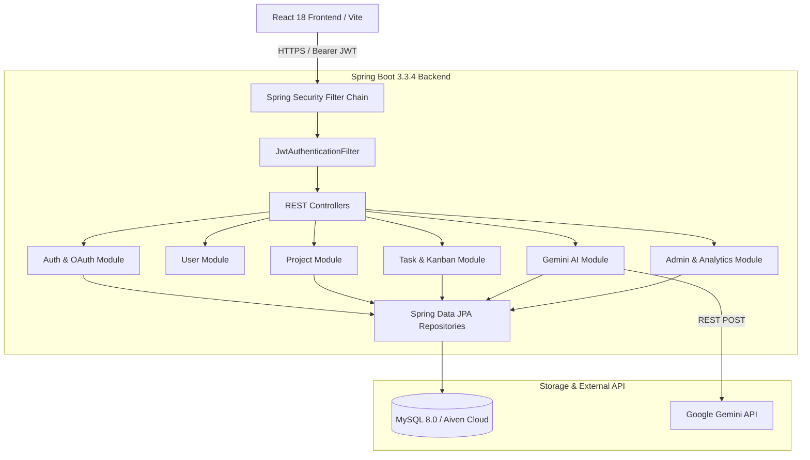

# TaskForge AI — Engineering Project Management Workspace

> An enterprise-grade, full-stack project management platform with dynamic Kanban boards, fine-grained RBAC, workspace analytics, and Google Gemini AI integration.

[](https://spring.io/projects/spring-boot)
[](https://react.dev/)
[](https://www.oracle.com/java/)
[](https://jwt.io/)
[](https://tailwindcss.com/)
[](LICENSE)

---

## 🌐 Live Deployments & Repository

- **Live Web Application**: [https://taskforge-ai-psi.vercel.app/](https://taskforge-ai-psi.vercel.app/)
- **Live Production API**: [https://taskforge-ai-k0ll.onrender.com/api/v1](https://taskforge-ai-k0ll.onrender.com/api/v1)
- **GitHub Repository**: [https://github.com/Jagadish0216/TaskForge-AI](https://github.com/Jagadish0216/TaskForge-AI)

---

## 📌 Table of Contents

- [Overview](#-overview)
- [Why TaskForge AI Exists](#-why-taskforge-ai-exists)
- [Key Features](#-key-features)
- [AI Mission Control](#-ai-mission-control)
- [AI Insights Co-Pilot](#-ai-insights-co-pilot)
- [Architecture Overview](#-architecture-overview)
- [Tech Stack](#-tech-stack)
- [Authentication and RBAC](#-authentication-and-rbac)
- [Demo Accounts](#-demo-accounts)
- [Local Development Setup](#-local-development-setup)
- [Environment Variables](#-environment-variables)
- [Project Structure](#-project-structure)
- [Testing](#-testing)
- [Deployment](#-deployment)
- [Screenshots](#-screenshots)
- [Roadmap](#-roadmap)
- [License](#-license)

---

## 💡 Overview

**TaskForge AI** is a production-deployed, full-stack software management workspace designed for engineering teams. It bridges core agile workflows—project creation, Kanban boards, sprint tracking, and role-based permissions—with generative AI assistance powered by **Google Gemini**.

Built with an **"Engineering Control Surface"** visual philosophy, TaskForge AI emphasizes high information density, precise typography, dark slate surfaces, and deterministic state transitions.

---

## 🎯 Why TaskForge AI Exists

Modern engineering teams often face administrative overhead when decomposing high-level features into structured sprints, identifying capacity bottlenecks, and maintaining consistent permission boundaries across projects.

TaskForge AI solves this by:
1. **Automating Sprint Scaffolding**: Using Google Gemini AI to transform feature requests into structured modules, tasks, priorities, and effort estimates.
2. **Enforcing Human-in-the-Loop AI Safeguards**: AI recommendations are generated as transient recommendations—requiring explicit user review and selection before any database write occurs.
3. **Providing Granular Security & Visibility**: Combining stateless JWT token authentication with fine-grained repository ownership checks (`ProjectAuthorizationService`).

---

## ✨ Key Features

### 📋 Project & Kanban Management
- **5-Column Kanban Board**: Visual workflow state machine (`Backlog`, `To Do`, `In Progress`, `In Review`, `Done`).
- **Canonical Dataset**: Scaffolding with the canonical **PULSE** project containing exactly 10 initial tasks cleanly balanced across workflow states.
- **Task Attributes**: Priority matrix (`LOW`, `MEDIUM`, `HIGH`, `URGENT`, `CRITICAL`), estimated hours, due dates, assignee binding, and threaded comments.
- **Project Discussions**: Threaded discussion channels per project with timestamped messages and author metadata.

### 📊 Workspace Analytics & Reporting
- **Executive Dashboard**: Real-time aggregation of task status distribution, project progress percentages, and workload breakdown.
- **Reporting Engine**: Dynamic velocity and completion metrics calculated over custom time windows.

### 🛡️ Platform Administration & Audits
- **Admin Portal**: System-wide statistics for users, active projects, system health, and global activity audit logs.
- **Activity Stream**: Automated recording of entity operations for compliance and operational tracking.

---

## 🤖 AI Mission Control

**AI Mission Control** is a centralized workspace interface designed for proactive project risk management and sprint planning.

### Core Workflows:
1. **Risk Radar**: Analyzes active project health, identifying task bottlenecks, overdue items, and workload imbalance before they impact delivery.
2. **Sprint Planner**: Scaffolds new project modules and sprints based on natural language prompts.
3. **Structured JSON Parsing**: Uses Jackson `ObjectMapper` on the backend to parse raw Gemini LLM outputs into structured `GeneratedProjectDTO` objects.
4. **Human-in-the-Loop Review**: Users review proposed tasks, select desired items via checkboxes, and explicitly confirm insertion.

```text
[ User Prompt / Context ]
          │
          ▼
[ AIService & IntentDetector ]
          │
          ▼
[ GeminiProvider (Multi-Model Fallback) ]
          │
          ▼
[ Google Gemini API ] ──(REST Payload)──► [ Structured DTO Parser ]
                                                   │
                                                   ▼
[ React UI Sprint Cards ] ◄──(Transient)───────────┘
          │
  (User Selects & Approves)
          │
          ▼
[ @Transactional Task Persistence ] ──► [ MySQL Database & Kanban ]
```

---

## 🧠 AI Insights Co-Pilot

Embedded directly inside project views, the **Project AI Co-Pilot** provides contextual recommendations tailored to the selected workspace.

- **Structured Sprint Cards**: Displays generated modules, tasks, priorities, and estimated hours in visual card layouts.
- **Developer Inspection Toggle**: Includes a **"View Raw JSON"** toggle allowing developers to inspect the underlying LLM response schema without cluttering the primary user view.
- **Shared Parser Architecture**: Utilizes a centralized, robust JSON parser (`parseAIJson`) shared between AI Mission Control and Project Co-Pilot to prevent rendering defects.

---

## 🏗️ Architecture Overview

TaskForge AI is structured as a decoupled N-tier application.



---

## 🛠️ Tech Stack

| Domain | Technology | Description |
| :--- | :--- | :--- |
| **Backend Framework** | Spring Boot 3.3.4 | Core REST services, Dependency Injection, JPA Auditing |
| **Language & JDK** | Java 21 / OpenJDK | Modern LTS Java runtime environment |
| **Security & Auth** | Spring Security & JJWT 0.12.6 | Stateless JWT Access/Refresh tokens, BCrypt hashing |
| **Frontend Framework** | React 18.2 | SPA architecture built with Vite 5 |
| **Styling & UI** | Tailwind CSS 3.4 | Custom "Engineering Control Surface" design system |
| **Icons & Charts** | Lucide React & Recharts | Technical vector icon suite and interactive charts |
| **Database Layer** | MySQL 8.0 / H2 | Relational database (Aiven MySQL in prod, H2 in dev) |
| **AI Processing** | Google Gemini API | `gemini-3.8-flash`, `gemini-3.7-flash`, `gemini-3.5-flash-lite` |

---

## 🔐 Authentication and RBAC

TaskForge AI enforces strict Role-Based Access Control at both the API security layer and service logic layer.

### System Roles:
- `ROLE_ADMIN`: Full operational control, platform analytics, global audit logs, and user management.
- `ROLE_PROJECT_MANAGER`: Create projects, plan AI sprints, manage project members, assign tasks.
- `ROLE_TEAM_MEMBER`: View assigned projects, update Kanban task statuses, post comments.

| Capability | Public | Team Member | Project Manager | Admin |
| :--- | :---: | :---: | :---: | :---: |
| View Public Landing Page | ✅ | ✅ | ✅ | ✅ |
| Authenticate (Login / Register) | ✅ | ✅ | ✅ | ✅ |
| View Assigned Projects & Kanban | ❌ | ✅ | ✅ | ✅ |
| Update Kanban Task Status | ❌ | ✅ | ✅ | ✅ |
| Create Project & Plan AI Sprint | ❌ | ❌ | ✅ | ✅ |
| Manage Project Members & Roles | ❌ | ❌ | ✅ | ✅ |
| Access Admin Portal & Audit Logs | ❌ | ❌ | ❌ | ✅ |

---

## 🔑 Demo Accounts

Use these pre-configured portfolio accounts for live evaluation:

| Role | Email | Password | Primary Context |
| :--- | :--- | :--- | :--- |
| **System Admin** | `admin@demo.taskforge.local` | `demo123` | Platform Admin Portal & Audit Logs |
| **Project Manager** | `manager@demo.taskforge.local` | `demo123` | PULSE Project Owner, AI Mission Control |
| **Team Member** | `member@demo.taskforge.local` | `demo123` | Kanban Task Assignee |

---

## ⚙️ Local Development Setup

### Prerequisites
- **JDK 17** or **JDK 21**
- **Node.js 18+** & **npm 9+**
- **MySQL 8.0** (or embedded H2 for zero-dependency local testing)

### 1. Backend Launch
```bash
# Navigate to backend
cd backend

# Execute unit & integration test suite (77 tests)
./mvnw.cmd clean test

# Launch with in-memory H2 profile & demo seed
./mvnw.cmd spring-boot:run "-Dspring-boot.run.jvmArguments=-Dspring.profiles.active=local,h2 -Dapp.seed-demo-data=true"
```
Backend API will listen on `http://localhost:8080/api/v1`.
Swagger UI: `http://localhost:8080/api/v1/swagger-ui.html`

### 2. Frontend Launch
```bash
# Navigate to frontend
cd frontend

# Install dependencies
npm install

# Test production compilation
npm run build

# Start Vite dev server
npm run dev
```
Frontend web app will run on `http://localhost:5173`.

---

## ⚡ Environment Variables

Configure system environment variables or cloud provider parameters:

| Variable | Location | Description |
| :--- | :--- | :--- |
| `SPRING_DATASOURCE_URL` | Backend | MySQL JDBC Connection String |
| `SPRING_DATASOURCE_USERNAME` | Backend | MySQL Database Username |
| `SPRING_DATASOURCE_PASSWORD` | Backend | MySQL Database Password |
| `JWT_SECRET` | Backend | HMAC-SHA512 Secret Signing Key (min 64 chars) |
| `GEMINI_API_KEY` | Backend | Google Gemini API Key |
| `VITE_API_BASE_URL` | Frontend | Target API Base URL (`https://taskforge-ai-k0ll.onrender.com/api/v1`) |

---

## 📁 Project Structure

```
TaskForge-AI/
├── backend/                             # Spring Boot 3.3.4 Backend
│   ├── src/main/java/com/taskforge/
│   │   ├── TaskForgeApplication.java
│   │   ├── config/                      # Web, Security, DataInitializer
│   │   ├── security/                    # JWT Filters & Token Provider
│   │   └── module/                      # Feature Modules
│   │       ├── auth/                    # Registration & Login
│   │       ├── user/                    # User Profiles & Roles
│   │       ├── project/                 # Projects & Memberships
│   │       ├── task/                    # Tasks & Kanban Engine
│   │       ├── ai/                      # Gemini Provider & Mission Control
│   │       ├── dashboard/               # Analytics Services
│   │       └── admin/                   # Platform Administration
│   └── pom.xml
│
├── frontend/                            # React 18 + Vite Frontend
│   ├── src/
│   │   ├── components/                  # Technical Card, Sidebar, Modal Components
│   │   ├── context/                     # AuthContext State
│   │   ├── pages/                       # Dashboard, Kanban, AI Workspace, Admin
│   │   ├── services/                    # Axios API Client & Interceptors
│   │   └── App.jsx
│   └── package.json
│
└── docs/                                # Technical Documentation & Architecture
    ├── architecture.md
    ├── demo-walkthrough.md
    ├── API_DOCUMENTATION.md
    ├── INSTALLATION_GUIDE.md
    └── screenshots/
        └── README.md
```

---

## 🧪 Testing

TaskForge AI includes a comprehensive unit and integration test suite covering security, services, repositories, and AI providers.

```bash
cd backend
./mvnw.cmd clean test
```

- **Test Suite Count**: 77 Tests across 12 Test Classes.
- **Coverage Areas**: JWT token generation, DataInitializer idempotency, intent detection, project authorization, analytics calculation, and Gemini provider retries.

---

## 🚀 Deployment

- **Frontend Deployment**: Deployed on **Vercel** (`https://taskforge-ai-psi.vercel.app/`).
- **Backend Deployment**: Deployed on **Render** as a Spring Boot containerized service (`https://taskforge-ai-k0ll.onrender.com/api/v1`).
- **Database**: Dedicated **Aiven MySQL 8.0** managed cloud database instance.

---

## 🖼️ Screenshots

Detailed capture requirements and portfolio presentation previews are documented in [docs/screenshots/README.md](docs/screenshots/README.md).

---

## 🗺️ Roadmap

- [x] Initial Spring Boot REST API & JWT security architecture
- [x] React 18 Kanban board & executive dashboard
- [x] Gemini AI integration & structured JSON sprint planner
- [x] DataInitializer idempotency & production portfolio data seed
- [x] Production deployment to Render, Vercel, and Aiven MySQL
- [ ] WebSocket-based real-time Kanban card movement synchronization
- [ ] Enterprise SAML / SSO integration

---

## 📄 License

Distributed under the **MIT License**. See [LICENSE](LICENSE) for details.
