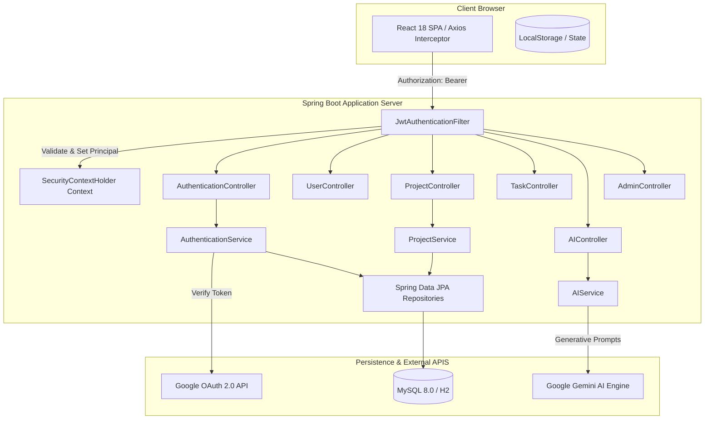
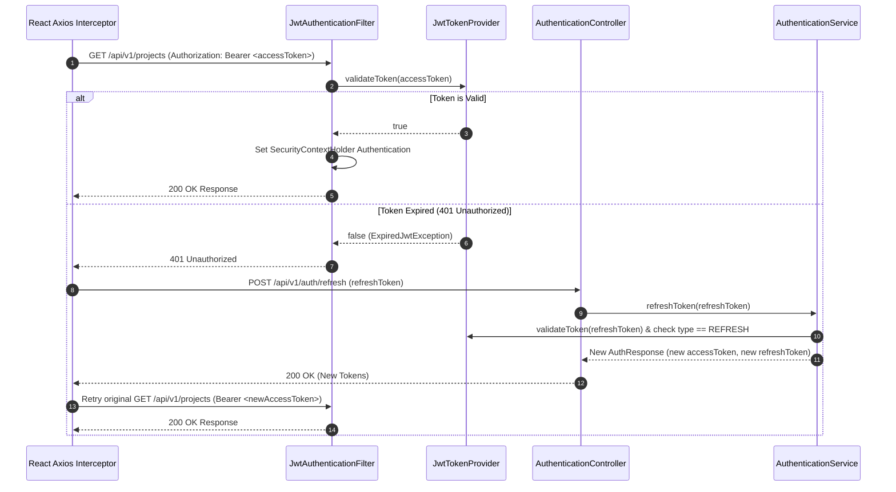
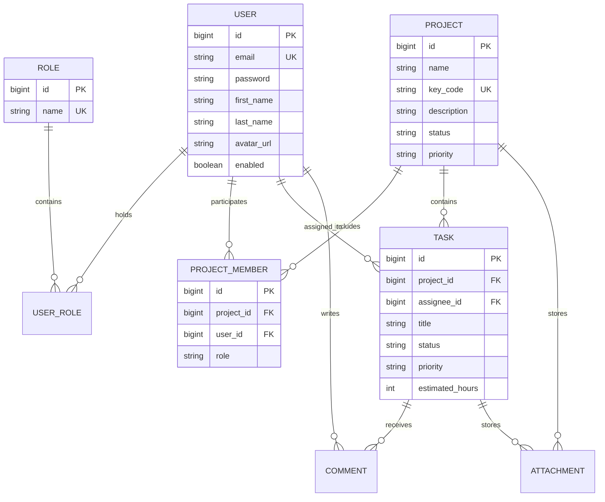

# 🏛️ TaskForge AI — System Architecture Specification

This document provides a technical overview of the architecture, security infrastructure, data model, and component interactions of **TaskForge AI**.

---

## 1. High-Level Architectural Pattern

TaskForge AI relies on a **Decoupled N-Tier Enterprise Architecture**:

1. **Presentation Layer (Frontend)**: React 18 Single Page Application (SPA) powered by Vite, Tailwind CSS, and Axios.
2. **Security & Gateway Layer**: Spring Security Filter Chain with custom `JwtAuthenticationFilter` and CORS configuration.
3. **Application & Business Layer**: Spring Boot REST Controllers, Domain Services, and Gemini AI Orchestrator.
4. **Persistence Layer**: Spring Data JPA with MySQL 8.0 / embedded H2 database.
5. **External Integration Services**: Google OAuth 2.0 Identity Services & Google Gemini AI API.

---

## 2. Authentication & Security Subsystem

### 2.1 Token Lifecycle & Structure

TaskForge AI implements stateless authentication using two tokens:

- **Access Token**:
  - **Type**: Signed JWT (HMAC-SHA512)
  - **Lifetime**: 15 minutes to 24 hours (configurable via `jwt.access-token-expiration-ms`)
  - **Claims**: `sub` (user email), `userId`, `roles` (`ROLE_ADMIN`, `ROLE_PROJECT_MANAGER`, `ROLE_TEAM_MEMBER`), `type` ("ACCESS"), `iat`, `exp`.
- **Refresh Token**:
  - **Type**: Signed JWT (HMAC-SHA512)
  - **Lifetime**: 7 days (configurable via `jwt.refresh-token-expiration-ms`)
  - **Claims**: `sub` (user email), `type` ("REFRESH"), `iat`, `exp`.

### 2.2 Token Validation & Renewal Sequence

---

## 3. Entity Relationship Data Model

---

## 4. Google OAuth 2.0 Integration

1. Frontend initiates login via Google Identity Services button (`https://accounts.google.com/gsi/client`).
2. Google returns an RSA-signed **Google ID Token** to the frontend.
3. Frontend sends `idToken` to backend `POST /api/v1/auth/google`.
4. Backend verifies ID token authenticity against Google Public Certificates using `GoogleIdTokenVerifier`.
5. User is retrieved by email or automatically registered with default `ROLE_TEAM_MEMBER` and profile picture.
6. Backend generates and returns standard TaskForge JWT Access and Refresh Tokens.
