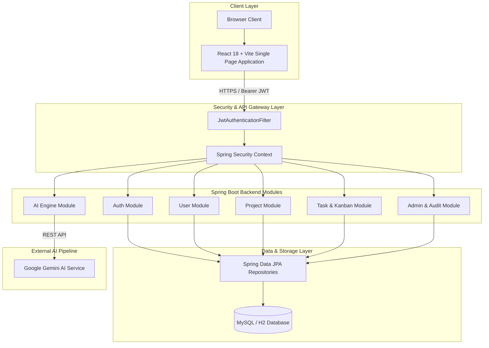
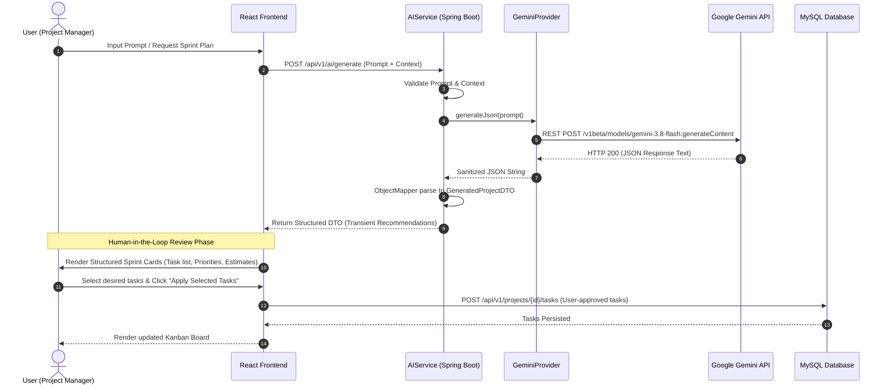

# TaskForge AI — System Architecture & Module Guide

This document provides a comprehensive technical overview of the architecture, data flow, security model, and module organization of **TaskForge AI**.

---

## 🏗️ Technical Architecture Overview

TaskForge AI follows an enterprise N-tier architecture. The frontend application operates as a client-side Single Page Application (SPA) communicating asynchronously with the Spring Boot REST API using JSON payloads secured with stateless HTTP Bearer tokens.

---

## 🤖 AI Mission Control & Co-Pilot Data Flow

TaskForge AI integrates generative AI directly into project workflows. A key architectural pattern is the **Human-in-the-Loop (Review-Before-Write)** model, ensuring AI output never mutates application state without explicit user review and confirmation.

---

## 📦 Core Backend Modules & Responsibilities

The backend application is structured into domain-driven feature modules under `com.taskforge.module`:

### 1. `com.taskforge.module.auth`
- Handles user registration, login authentication, token refresh, and Google OAuth 2.0 verification.
- Interacts with `JwtTokenProvider` to generate and validate HMAC-SHA512 signed JWT access and refresh tokens.

### 2. `com.taskforge.module.user`
- Manages user profile information, role assignments, avatar metadata, and user settings.
- Exposes user lookup services required for task assignments.

### 3. `com.taskforge.module.project`
- Manages project lifecycles, project keys, status transitions (`PLANNING`, `IN_PROGRESS`, `COMPLETED`, `ON_HOLD`), priority, and visibility (`PUBLIC`, `PRIVATE`).
- Controls project membership (`ProjectMember`) and threaded discussions (`ProjectMessage`).

### 4. `com.taskforge.module.task`
- Core task and Kanban engine. Supports task creation, status movement (`BACKLOG`, `TODO`, `IN_PROGRESS`, `IN_REVIEW`, `DONE`), priority levels, assigned users, due dates, and estimated hours.
- Handles threaded task comments (`Comment`) and historical comment edits (`CommentHistory`).

### 5. `com.taskforge.module.ai`
- Houses `AIService`, `GeminiProvider`, and `IntentDetector`.
- `GeminiProvider` implements multi-model fallback (`gemini-3.8-flash`, `gemini-3.7-flash`, `gemini-3.5-flash-lite`), exponential backoff retries, and rate-limit handling.
- Differentiates project generation prompts from standard conversational workspace chat.

### 6. `com.taskforge.module.dashboard`
- Aggregates workspace metrics, project status distribution, task completion velocity, and user workload statistics.

### 7. `com.taskforge.module.admin`
- Reserved for `ROLE_ADMIN` operations: system analytics, platform audit logs, user management, and system announcements.

### 8. `com.taskforge.module.notification`
- In-app notification engine notifying users of task assignments, comment mentions, and status updates.

### 9. `com.taskforge.module.activity`
- Global activity logger recording entity creations, updates, and membership changes for workspace transparency.

---

## 🔐 Security & Authorization Architecture

1. **Stateless Request Processing**: Session creation policy is set to `STATELESS`. Spring Security authenticates every incoming request via `JwtAuthenticationFilter`.
2. **Authority Mapping**: User roles (`ROLE_ADMIN`, `ROLE_PROJECT_MANAGER`, `ROLE_TEAM_MEMBER`) are embedded as claims in the JWT token and mapped to `GrantedAuthority` objects.
3. **Repository-Level Authorization**: Sensitive operations utilize `ProjectAuthorizationService` to ensure users can only modify projects and tasks to which they hold active membership.
