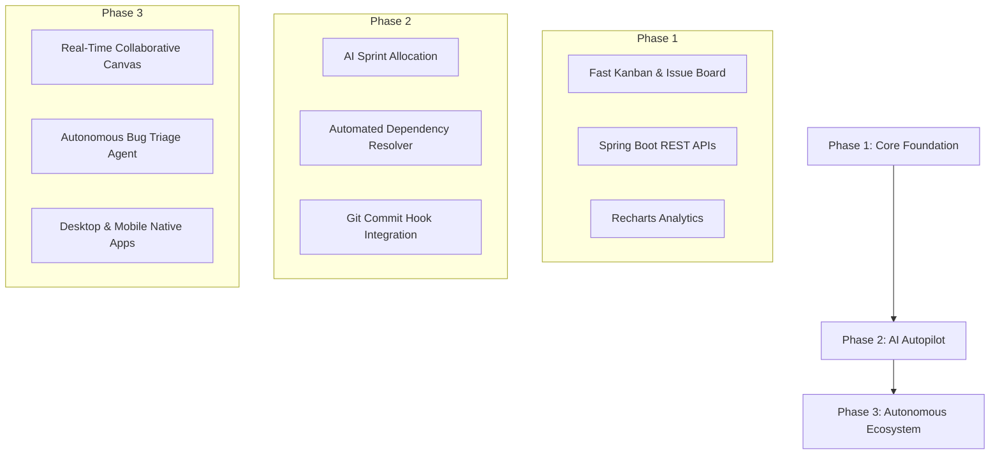

# TaskForge AI — Product Vision & Ecosystem Architecture

## 1. What is TaskForge AI?
TaskForge AI is an **AI-First Software Engineering Workspace** that integrates issue tracking, Kanban sprint boards, workload capacity analytics, and automated backlog scheduling into a unified, high-performance platform.

---

## 2. Why Does TaskForge AI Exist?
Modern software engineering teams operate under extreme velocity demands. However, existing toolchains suffer from severe fragmentation:
- Issues live in one tool (Jira / Linear)
- Discussions happen in another (Slack / Discord)
- Roadmaps live in spreadsheets or Notion docs
- Capacity calculations are done manually in Excel

TaskForge AI eliminates this fragmentation by creating a central source of truth where background AI automatically connects tasks, team capacity, sprint deadlines, and activity metrics.

---

## 3. Core Problems Solved
1. **Administrative Overhead**: Engineers spend up to 20% of their sprint time updating issue statuses and filling out ticket metadata.
2. **Inaccurate Velocity Predictions**: Human capacity estimation is notoriously flawed. TaskForge AI analyzes past velocity to project realistic sprint limits.
3. **Context Switching**: Fragmented notifications across tools break developer flow state.
4. **Sluggish User Interfaces**: Traditional enterprise web apps take seconds to render simple list updates. TaskForge AI delivers sub-50ms reactive updates.

---

## 4. Competitive Matrix & Differentiation

| Feature / Dimension | Jira | Trello | ClickUp | Notion | GitHub Projects | TaskForge AI |
| :--- | :--- | :--- | :--- | :--- | :--- | :--- |
| **Speed & Responsiveness** | Slow | Moderate | Moderate | Moderate | Fast | **Lightning Fast (<50ms)** |
| **AI Backlog Scheduling** | Basic add-on | Plugins | Basic AI | Text AI | None | **Native Core Engine** |
| **UI Aesthetics** | Legacy Enterprise | Basic Cards | Busy / Cluttered | Document First | Code Focused | **SaaS 2026 Minimal Glass** |
| **Developer Ergonomics** | Low | Low | Medium | Medium | High | **Maximum (Keyboard ⌘K)** |
| **Setup Overhead** | Hours/Days | Minutes | Hours | Hours | Minutes | **Instant (< 30 Seconds)** |

---

## 5. Short-Term vs. Long-Term Vision

### Short-Term Vision (6 Months)
Establish TaskForge AI as the sleekest, fastest standalone project management solution for engineering squads of 5–50 developers. Focus on sub-50ms rendering, dual Kanban/List view perfection, and automated sprint capacity suggestions.

### Long-Term Vision (2–3 Years)
Evolution into an **Autonomous Project Co-Pilot**. TaskForge AI will monitor Git repositories, pull requests, and CI/CD pipelines in real time, automatically transitioning tasks based on code commits, triaging incoming bug reports, and generating sprint retrospectives autonomously.

---

## 6. Target Ecosystem Architecture
- **Web Application**: Vite React 18 frontend with TailwindCSS, Lucide icons, and Framer Motion.
- **Backend Infrastructure**: Spring Boot 3 Java backend microservices with JWT authentication and PostgreSQL storage.
- **AI Engine Layer**: LLM-based capacity evaluator and task decomposition engine.
- **Git Provider Connectors**: Bi-directional hooks for GitHub Actions, GitLab CI, and Bitbucket.
